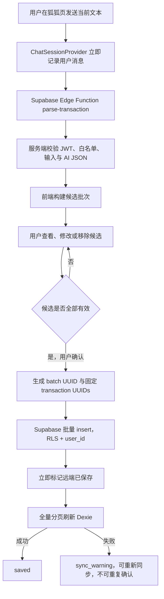

# FoxLedger V3.0「狐狐对话记账」可执行设计

## 1. 文档状态

- 目标版本：V3.0
- 原始代码基线：v2.3.1 Vite PWA + Supabase Edge AI API
- 文档性质：已确认产品边界后的实施设计与 V3.0 验收依据
- 适用仓库：`D:\fox\foxledger` Web/PWA
- 前置决定：允许为 V3.0 增加最小 Supabase schema 变更 `ai_batch_id`
- 当前实施状态：M0–M5 已于 2026-08-13 完成代码、自动化和本地生产构建；静态前端尚未执行生产部署，真机 PWA 更新与生产发布验收待完成

本设计描述目标契约，不单独证明生产已经发布 V3.0；仓库代码、目标 Supabase、真机 PWA、生产部署和交接文档必须共同通过验收。

## 2. 发布目标

V3.0 必须一次交付完整闭环：

> 说 → 理解 → 核对 → 记账 → 查看 → 修改 → 撤销

它不是给现有 `AiParsePanel` 套聊天外观。公开发布版本必须同时具备候选管理、正式保存、保存后单笔管理、最近 AI 批次和整组撤销。

## 3. 范围

### 3.1 必须完成

- 新增独立懒加载路由 `/chat`。
- 底部导航调整为：首页、账单、狐狐、统计、设置；狐狐位于中央。
- 首页移除主流程中的 `AiParsePanel`，替换为“和狐狐记一笔”入口。
- 用户消息立即显示，AI 解析期间显示 listening/thinking 状态。
- 复用现有 `parse-transaction`，不增加用于生成寒暄文案的第二次 AI 请求。
- 多笔候选收纳为一张摘要卡，支持详情、编辑、移除和确认。
- 存在未补全候选时禁止整批确认；用户必须补全或移除该候选。
- 用户确认后才写 Supabase。
- 同一次确认保存的账单使用相同 `ai_batch_id`。
- 保存返回真实 transaction IDs。
- 保存后支持改单笔、删单笔和撤销整组。
- 从 Dexie 已同步缓存重建最近 AI 记账批次。
- 区分远端写入成功和本地缓存刷新失败。
- 当前聊天跨应用内路由保留，刷新、关闭、登录失效或退出后清除。
- 新增原创轻量狐狐角色与五种状态。
- 补齐自动化测试、移动端、无障碍和 PWA 验收。

### 3.2 明确不做

- 不新增 `ai_batches`、`chat_sessions` 或 `chat_messages` 表。
- 不持久化逐字聊天、问候语或 AI 原始响应。
- 不做通用陪聊、AI 问账、语音、OCR、图片记账或原生能力。
- 不让 AI 直接写、修改或删除数据库。
- 不改变现有 RLS 原则，不使用 `service_role`。
- 不全面重做账单、统计和设置页面的视觉。
- 不实现离线正式写入或离线同步队列。

## 4. 总体架构



## 5. Supabase 数据设计

### 5.1 Migration

新增：

```text
supabase/migrations/003_add_ai_batch_id.sql
```

建议 SQL：

```sql
alter table public.transactions
  add column if not exists ai_batch_id uuid;

alter table public.transactions
  drop constraint if exists transactions_ai_batch_source_check;

alter table public.transactions
  add constraint transactions_ai_batch_source_check
  check (ai_batch_id is null or source = 'ai');

create index if not exists transactions_user_id_ai_batch_id_created_at_idx
  on public.transactions (user_id, ai_batch_id, created_at desc)
  where ai_batch_id is not null;
```

验证 SQL 必须检查：

- 字段存在且允许 `null`；
- check constraint 生效；
- partial index 存在；
- 四条现有 RLS policy 仍启用；
- `authenticated` 的现有权限没有扩大；
- 用户 A 无法查询或删除用户 B 的 batch。

### 5.2 字段规则

- AI 对话一次确认生成一个 `crypto.randomUUID()`。
- 同一批所有已选择候选写入相同 `ai_batch_id`。
- 手动记账与 CSV 导入始终写 `null` 或省略该字段。
- 单笔编辑不得修改 `ai_batch_id`。
- 单笔删除后，批次由剩余真实账单重新计算。
- 最后一笔删除或整组撤销后，批次不再存在。
- 当前会话可以显示 `undone`；刷新后不保留已撤销记录。

### 5.3 不增加批次表的后果

- 批次只由仍存在的 transaction 行定义。
- 无法持久保存“已撤销”历史，这是已确认的产品行为。
- 批次标题、数量、合计和时间全部由真实账单确定性派生。
- 不保存完整用户消息作为批次标题。

## 6. 类型与缓存契约

### 6.1 交易类型

在 `src/features/transactions/types.ts` 中调整：

```ts
type CachedTransaction = {
  ai_batch_id: string | null;
  // 保留现有字段
};

type TransactionInsertPayload = {
  ai_batch_id?: string | null;
  id?: string;
  // 保留现有字段
};
```

更推荐为 AI 批量保存单独定义窄类型，避免手动记账或 CSV 调用方传入 batch：

```ts
type AiBatchTransactionInsert = TransactionInsertPayload & {
  ai_batch_id: string;
  id: string;
  source: "ai";
};
```

### 6.2 远端同步

`TRANSACTION_CACHE_SELECT` 增加 `ai_batch_id`。`normalizeRemoteCacheRow()` 必须验证：

- `user_id` 等于当前用户；
- `ai_batch_id` 是 `null` 或合法 UUID 字符串；
- `source !== "ai"` 时 `ai_batch_id` 必须为 `null`；
- 其他交易规则保持不变。

全量同步规则不变：500 条/页、稳定排序、全部页成功后才替换当前用户缓存、任一页失败保留上次完整缓存。

### 6.3 Dexie v4

`src/lib/localDb.ts` 增加 version 4：

```text
sync_meta:
  user_id, sync_state, updated_at

transactions_cache:
  cache_key, user_id, id, date, created_at, updated_at,
  type, category, ai_batch_id,
  [user_id+date], [user_id+ai_batch_id]
```

要求：

- 不清空 v3 数据；升级只改变索引定义。
- 下一次成功全量同步补齐 `ai_batch_id`。
- 手动/CSV 行的 `ai_batch_id = null`，不参与 AI 批次分组。
- IndexedDB 仍不缓存 `raw_text`、AI 原始响应、token、登录响应、`tag`、`account` 或 `ai_confidence`。

注意：Dexie 数据库一旦升级到 v4，精确回滚到只认识 v3 的旧前端可能触发版本不兼容。生产回退必须使用保留 v4 schema 的兼容构建或向前修复，不能简单重新部署原 v2.3.1 产物。

## 7. 新 AI 账单的 `raw_text` 规则

- `parse-transaction` 继续返回经过服务端验证的 `raw_text`，用于证明金额来自当前输入。
- 候选编辑和最终校验期间，`raw_text` 只存在当前内存会话。
- V3.0 新确认的 AI 账单写库时不再提交 `raw_text`，数据库值为 `null`。
- 既有远端 `raw_text` 不迁移、不批量清理。
- 最近批次、保存后详情和撤销均不得依赖 `raw_text`。

## 8. 批量保存、幂等与同步语义

### 8.1 API 返回值

将 `insertTransactionsForUser()` 从返回数量调整为返回真实 IDs：

```ts
Promise<string[]>
```

返回前必须验证：

- 返回行数等于提交行数；
- 每个返回 ID 均在预期 ID 集合中；
- 不允许空结果被视为成功。

### 8.2 固定 ID 与重复提交协调

保存开始前一次性生成：

- 一个 `batchId`；
- 每个待保存候选一个固定 `transactionId`。

重试不得重新生成这些 ID。这样数据库主键和 `ai_batch_id` 可以用于协调“请求已提交但响应丢失”的不确定状态。

保存异常后执行一次只读协调查询：

1. 按 `user_id + ai_batch_id` 查询远端 IDs。
2. 如果与预期 ID 集合完全一致，按保存成功处理。
3. 如果为零条，允许用户用原 IDs 重试。
4. 如果出现非零但不完整集合，进入明确错误状态，禁止自动补写或重复确认，提示重新同步并人工核对。

不自动无限重试 AI 或数据库写操作。

### 8.3 远端成功与缓存同步分离

```text
insert 成功
→ chat batch 立即进入 saved
→ refreshAfterWrite()
→ 成功：保持 saved
→ 失败：进入 sync_warning
```

`sync_warning` 必须：

- 显示“账单已经保存，但本地缓存暂时没有刷新成功”；
- 提供“重新同步”；
- 保留 transaction IDs 和 `batchId`；
- 禁止重新出现“确认记账”；
- 账单页和统计页继续明确显示上次完整缓存。

编辑、单笔删除和整组撤销也使用相同的“远端结果先确定、本地同步后处理”原则。

## 9. Chat 内存模型

### 9.1 Provider 生命周期

新增用户级 `ChatSessionProvider`，放在登录后的 `AppShell` 内、路由 `Outlet` 之外。

- 在首页、账单、狐狐、统计和设置之间切换时保留。
- 刷新页面、关闭 PWA、登录失效或退出后清除。
- 不写 localStorage、sessionStorage、IndexedDB 或 Supabase。
- Provider 必须以当前 `user.id` 为隔离键；用户变化立即 reset。

### 9.2 建议类型

```ts
type ChatMessageType = "text" | "parsing" | "ledger_result" | "error";
type ChatRole = "user" | "assistant" | "system";

type AiBatchStatus =
  | "draft"
  | "needs_attention"
  | "saving"
  | "saved"
  | "sync_warning"
  | "undoing"
  | "undone"
  | "error";
```

`ChatMessage` 只保存渲染当前会话所需的数据。正式账单状态必须以 transaction IDs、batch ID 和最新缓存为依据，不能相信旧消息副本。

### 9.3 Reducer 不变量

- `draft/needs_attention → saving` 只能由用户确认触发。
- `saving → saved` 由远端 insert 或协调查询确认。
- 远端成功后不得回到 `draft`。
- `saved → sync_warning` 只表示缓存刷新失败，不表示远端写失败。
- `saved/sync_warning → undoing → undone`。
- `undone` 不允许再次撤销或确认。
- 用户退出时所有状态清空。

## 10. 最近 AI 批次

新增纯函数和 Dexie 读取层，例如：

```text
src/features/chat/recentAiBatches.ts
```

分组规则：

- 只读取当前 `userId` 且 `ai_batch_id !== null` 的缓存行。
- 按 `ai_batch_id` 分组。
- 批次时间使用组内最早 `created_at`，排序使用组内最新 `created_at` 倒序。
- 数量、收入、支出、结余和交易列表由组内当前真实行实时计算。
- `transfer` 不计入收入、支出和结余。
- 默认展示最近 20 个批次，并支持继续加载缓存中的其余批次。
- 离线允许读取列表和详情，禁止编辑、删除和撤销。
- 单笔删除后刷新缓存，批次立即按剩余行重新计算。

## 11. UI 与组件设计

### 11.1 路由和入口

- `src/routes/ChatPage.tsx`：路由级 lazy load。
- `src/components/BottomNav.tsx`：加入居中“狐狐”。
- `src/routes/HomePage.tsx`：移除主 UI 中的 `AiParsePanel`，增加 `/chat` 入口卡。
- 保留现有 AI API 与清洗模块；旧 UI 组件在新流程稳定后删除，不长期维护两套入口。

### 11.2 建议目录

```text
src/features/chat/
  ChatSessionProvider.tsx
  chatReducer.ts
  chatTypes.ts
  chatCopy.ts
  ChatComposer.tsx
  ChatMessageList.tsx
  UserMessageBubble.tsx
  AssistantMessageBubble.tsx
  LedgerResultCard.tsx
  BatchDetailSheet.tsx
  CandidateTransactionEditor.tsx
  SavedTransactionEditor.tsx
  FoxMascot.tsx
  batchCalculations.ts
  recentAiBatches.ts
```

允许在实现中合并过小组件；禁止为了匹配文件清单制造无价值抽象。

### 11.3 候选与正式编辑

- 候选编辑只修改内存 draft，不写 Supabase。
- 字段：类型、金额、分类、日期、商家、支付方式、备注。
- 抽取共享 `TransactionEditorFields` 时必须保证手动表单行为不回归。
- 正式账单编辑复用现有 `updateTransaction()` 和明确的当前用户约束。
- 删除正式账单必须二次确认。
- 整组撤销调用现有多 ID 删除能力并显式 `.eq("user_id", userId)`。

### 11.4 确定性狐狐文案

- 解析、候选数量、收入/支出数量、保存、删除、撤销和错误文案由前端模板生成。
- 不为了角色回复增加第二次模型调用。
- 不评价消费、不制造焦虑、不频繁使用 emoji。
- 空解析不创建空结果卡。
- 50 条截断必须显著提示。

### 11.5 狐狐视觉

- 状态：normal、listening、thinking、happy、confused。
- 使用原创 SVG/WebP 与 CSS 微动画，不复制其他应用素材。
- 全部角色资源不超过 1 MB，单张建议 50–120 KB。
- 支持 `prefers-reduced-motion`。
- 角色纯装饰时 `aria-hidden="true"`。
- V3.0 只重点改造狐狐页、首页入口和导航，不全面换肤。

### 11.6 移动端和无障碍

- Composer 位于 BottomNav 上方，处理 iOS Safe Area 和 Android 手势区。
- 软键盘弹起后输入框和发送按钮必须可见。
- 新消息自动滚动；用户主动向上浏览时不得强制拉回底部。
- Bottom Sheet 最大高度约 90vh，内部滚动，关闭后焦点回到触发元素。
- 关键点击目标不低于约 44 px。
- processing 使用 `aria-live`、`aria-busy`；所有状态不能只靠颜色表达。

## 12. 安全和隐私不变量

- AI 仍只接收当前输入文本。
- 不发送历史账单、统计数据或 Dexie 给 `parse-transaction`。
- Edge Function 必须验证 access token 和 `ALLOWED_EMAILS`。
- Edge Function 使用 publishable/anon key，不使用 `service_role`。
- AI 不能直接写库；用户确认后由前端交易 API 写入。
- 所有读取、更新和删除继续显式约束当前 `user_id`，同时依赖 RLS。
- Service Worker 不缓存 Supabase、Auth 或 AI API 响应。
- 当前聊天、候选 draft 和 `raw_text` 不落本地持久存储。
- 退出登录继续清除当前用户 Dexie 缓存、Query cache 和 Chat 内存状态。

## 13. 内部实施批次

### M0：测试基础与契约冻结

- 增加 Vitest、React Testing Library、jsdom 和测试脚本。
- 为现有日期、统计、交易规则和 AI 候选规则补回归测试。
- 固化当前 API、缓存和 RLS 验收基线。

完成标准：未改变业务行为，`lint + typecheck + test + build` 全部通过。

### M1：远端 batch 契约

- 编写并审查 `003_add_ai_batch_id.sql`。
- 更新类型、select、normalize、insert 返回 IDs。
- 实现固定 ID、批次 ID 和写入协调逻辑。
- 禁止新 AI 写入 `raw_text`。

完成标准：migration 验证、用户隔离、重复提交协调和 API 测试通过。

### M2：Dexie v4 与批次读取

- 增加 v4 schema 和复合索引。
- 全量同步缓存 `ai_batch_id`。
- 实现批次分组、合计、排序和详情读取。
- 验证 v3 → v4 升级不丢缓存；远端失败不替换上次缓存。

完成标准：在线/离线批次读取和同步失败路径通过。

### M3：Chat Shell 与候选闭环

- 新增 `/chat`、导航、首页入口、内存 Provider 和 reducer。
- 接入现有 parser。
- 实现消息、thinking、结果摘要、详情、候选编辑和移除。
- 实现 needs_attention 阻断规则。

完成标准：确认前数据库无新增；Case A–E 通过。

### M4：保存后管理

- 实现 saved/sync_warning。
- 实现最近批次、正式单笔编辑、删除和整组撤销。
- 实现部分删除后撤销剩余行。
- 实现跨路由保留、刷新清空和退出清空。

完成标准：Case F–K 通过，远端成功/同步失败不会重复记账。

### M5：视觉、PWA 与发布验收

- 完成原创狐狐状态资产和微动画。
- 完成键盘、滚动、Safe Area、焦点和 reduced motion。
- 验证 Chat chunk、角色资源预算和 Workbox 缓存边界。
- 更新 README、AGENTS 和 PROJECT_HANDOFF。

完成标准：自动检查、真机验收和安全清单全部通过。

## 14. 自动化测试矩阵

至少覆盖：

- 候选 draft 创建、金额、分类、日期和 clarification 校验；
- 批次收入/支出/转账合计；
- 最近批次分组、排序和分页；
- reducer 合法与非法状态转换；
- insert 返回 IDs、返回数量不一致和协调查询；
- 远端 insert 成功但 Dexie 同步失败；
- 单笔编辑不改变 batch；
- 删除一笔后的批次重算；
- 部分删除后的整组撤销；
- 用户 A/B 隔离的 API 调用参数；
- 跨路由保留和退出清空；
- 离线禁用所有写操作；
- 空解析、401、403、超时和 50 条截断文案。

真实 Supabase migration/RLS、真实 AI、iPhone/Android PWA 和 Service Worker 更新继续人工验收，不把真实密钥写入测试或仓库。

## 15. 部署顺序与回退

1. 在目标 Supabase 项目执行并验证 `003_add_ai_batch_id.sql`。
2. 部署仍兼容旧客户端的 schema；此时旧 v2.3.1 可继续运行。
3. 部署 V3.0 静态前端。
4. 验证 Dexie v4、全量同步、AI 保存、单笔管理和整组撤销。
5. 验证已安装 PWA 获取新版 Service Worker 和资源。

回退原则：

- migration 为向后兼容的 nullable 字段，发生前端问题时不删除列。
- 不执行破坏性 down migration。
- Dexie 已升级到 v4 后，不回退到只声明 v3 的旧构建；使用保留 v4 schema 的兼容热修复。
- 远端账单已经成功写入时不得因 UI 回退重复插入。

## 16. 发布验收

V3.0 发布前必须满足：

- PRD Case A–K 全部通过。
- 多笔保存、单笔修改、单笔删除和整组撤销稳定。
- 刷新后可从缓存恢复仍存在的最近 AI 批次。
- 撤销后刷新不再显示该批次，符合已确认行为。
- 同步失败不会把已保存批次退回待确认。
- 未登录和非白名单无法使用 AI 解析。
- 离线只能查看批次和账单，不能解析或写入。
- RLS 与显式 `user_id` 约束均保留。
- 新 AI 账单不持久化 `raw_text`。
- Chat 路由独立分包，角色资源总量不超过 1 MB。
- `npm run lint`、`npm run typecheck`、`npm run test`、`npm run build` 全部通过。

## 17. 完成定义

只有当代码、migration、测试、真机验收和仓库文档共同反映同一真实状态时，才能把 V3.0 标记为完成。任何内部里程碑都不得单独对外称为 V3.0。
