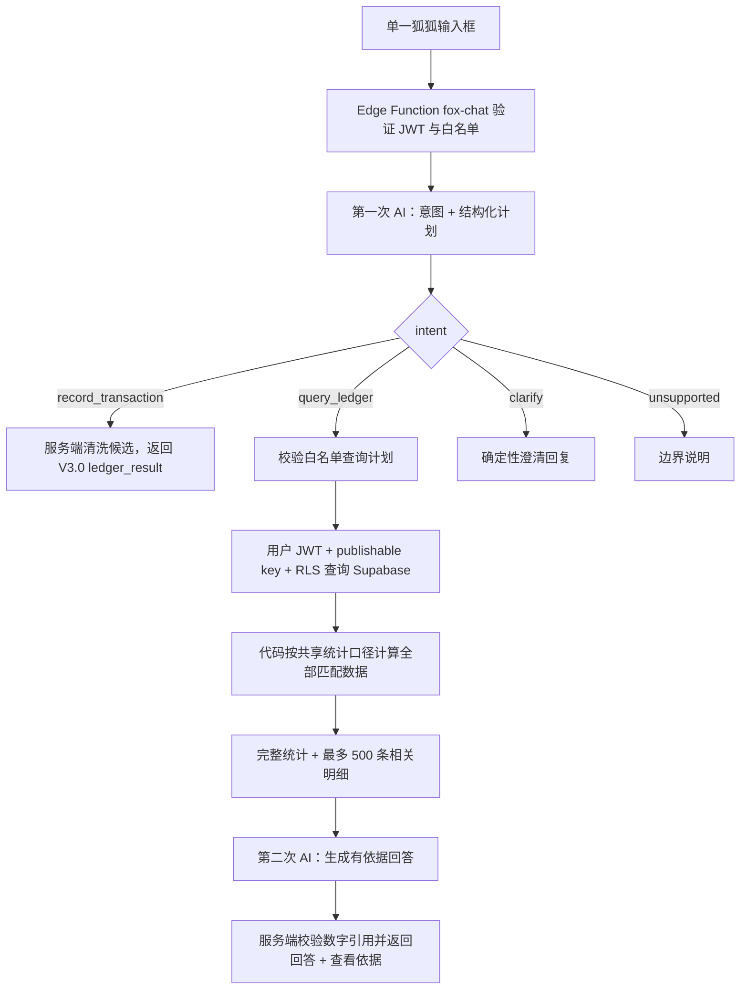

# FoxLedger V3.1「狐狐账本」可执行设计

## 1. 文档状态

- 目标版本：V3.1
- 前置版本：V3.0「狐狐对话记账」完整发布并稳定
- 文档性质：已确认产品边界后的实施设计，尚未实现
- 适用仓库：`D:\fox\foxledger` Web/PWA

V3.1 同时交付三部分：受限工具型 AI 问账、全站体验统一、质量基线。它不是简单的自然语言统计入口，也不是通用聊天机器人。

## 2. 发布目标

让用户可以在同一个狐狐输入框中自然地记账或问账：

- “午饭 32”进入 V3.0 候选确认流程；
- “这个月餐饮为什么比上月高？”进入只读问账；
- “那上个月呢？”基于当前内存中的结构化上下文继续追问；
- 狐狐基于代码计算的真实结果解释，不自行编造正式统计。

同时将 V3.0 的品牌语言推广到全站，并把自动化测试、无障碍、弱网和 PWA 验收提升为发布门槛。

## 3. 范围

### 3.1 必须完成

- 狐狐页维持一个输入框，不增加“记账/问账”模式开关。
- AI 自动分类为：记账、问账、需要澄清、不支持。
- 用户可用“我是想记账/我是想问账”纠正意图。
- 问账采用两次模型调用：查询计划 → 代码执行 → 自然回答。
- Edge Function 使用当前用户 JWT、publishable key 和 RLS 查询 Supabase。
- 代码对完整匹配数据执行正式统计。
- 保留现有统计页、日期范围和统计方法。
- AI 可以收到完整的相关统计结果，并优先依据统计回答。
- AI 可以收到最多 500 条相关账单明细。
- 商家名称允许随相关明细无条件发送。
- 支持有依据的解释、周期比较、趋势、变化来源和轻建议。
- 支持当前内存会话中的结构化连续追问。
- 回答提供日期范围、核心数字和“查看依据”。
- 登录、首页、账单、狐狐、统计、设置统一设计语言。
- 增强同步最近时间、失败原因和手动重试。
- 自动化测试与关键浏览器流程成为发布门槛。

### 3.2 明确不做

- 不做通用陪聊、情感陪伴、投资顾问或自动预算决策。
- 不允许 AI 自由生成 SQL。
- 不允许 AI 新增、修改或删除账单。
- 不新增聊天表，不持久化逐字问答。
- 不把 Dexie、完整账本或无关交易批量上传给 AI。
- 不发送 `user_id`、transaction ID、`raw_text`、备注、账户、支付方式、标签或 AI 置信度给模型。
- 不使用 `service_role`，不绕过 RLS。
- 不做语音、OCR、图片或其他多模态能力。
- 不新增首次授权弹窗或问账开关；登录用户默认可使用问账。

## 4. 总体架构



浏览器永远不直接调用模型。`fox-chat` 不执行任何数据库写操作。

## 5. Edge Function 设计

### 5.1 新函数

建议新增：

```text
supabase/functions/fox-chat/index.ts
supabase/functions/_shared/auth.ts
supabase/functions/_shared/aiClient.ts
supabase/functions/_shared/transactionSanitizer.ts
supabase/functions/_shared/ledgerAnalytics.ts
supabase/functions/_shared/ledgerQueryPlan.ts
```

`parse-transaction` 继续保留。公共 JWT、白名单、AI client 和候选清洗逻辑应逐步抽到 `_shared`，避免两个函数的安全规则漂移。

`supabase/config.toml` 增加：

```toml
[functions.fox-chat]
verify_jwt = false
```

这只用于自处理 CORS 和中文错误；函数内部必须继续验证 bearer token。

### 5.2 请求

```ts
type FoxChatRequest = {
  text: string;
  previous_context?: LedgerConversationContext | null;
};
```

`previous_context` 只允许：

- 上一轮经过服务端验证的 normalized intent；
- 上一轮 normalized query plan；
- 服务端日期锚点和范围标签；
- 不包含旧用户消息、旧 AI 回答、账单明细或统计结果。

服务端必须重新校验客户端传回的 context，不能直接信任。

### 5.3 第一次 AI 响应

使用严格 JSON discriminated union：

```ts
type ChatIntentResult =
  | { intent: "record_transaction"; transactions: unknown[] }
  | { intent: "query_ledger"; plan: unknown }
  | { intent: "clarify"; clarification_key: string }
  | { intent: "unsupported"; reason_key: string };
```

规则：

- 记账意图必须经过与 `parse-transaction` 相同的金额来源、日期、类型、分类和敏感长数字校验。
- 问账计划必须经过代码白名单解析，AI 输出不能直接拼接查询。
- clarify/unsupported 使用前端或服务端模板文案，不信任任意模型文案。
- 纠错动作重新提交原文本并带强制 intent，不执行数据库写入。

### 5.4 两次 AI 调用

问账固定为：

1. 第一次 AI 生成 intent 与一个可包含多个 operation 的查询计划。
2. 服务端完整执行计划并生成统计包和相关明细。
3. 第二次 AI 基于结果生成解释。

不采用“预先把大量账本发给第一次 AI 猜范围”的单次调用模式。

## 6. 查询计划

### 6.1 建议 schema

```ts
type LedgerQueryPlan = {
  operations: LedgerQueryOperation[];
  answer_goal: "lookup" | "summary" | "comparison" | "trend" | "explanation";
};

type LedgerQueryOperation = {
  range: {
    startDate: string;
    endDate: string;
    label: string;
  };
  compareRange?: {
    startDate: string;
    endDate: string;
    label: string;
  };
  filters: {
    types: Array<"expense" | "income" | "transfer">;
    categories: string[];
    merchants: string[];
    keyword: string | null;
    minAmount: number | null;
    maxAmount: number | null;
  };
  metrics: Array<
    | "count"
    | "expense"
    | "income"
    | "balance"
    | "average_daily_expense"
    | "max_expense"
  >;
  groupBy: Array<"day" | "week" | "month" | "category" | "merchant" | "type">;
  order: "date_asc" | "date_desc" | "amount_asc" | "amount_desc";
};
```

代码校验必须：

- 使用浏览器/服务端约定的本地日期语义，不直接用 UTC `toISOString()` 切业务日期；
- 限制 enum、日期格式和范围顺序；
- 分类继续使用默认分类；
- 金额必须有限且非负；
- 拒绝未知字段和未知操作；
- 对空计划和矛盾计划返回可理解错误；
- 不把计划转换成原始 SQL 字符串。

### 6.2 连续追问

例如上一轮：

```json
{
  "range": "this_month",
  "category": "餐饮",
  "metric": "expense"
}
```

当前问题：“那上个月呢？”

第一次 AI 只接收当前问题和上述经过校验的结构化计划，生成上月同类计划。刷新、关闭、登录失效或退出后 context 清除。

## 7. 数据读取与 RLS

### 7.1 事实源

- AI 问账以 Supabase 正式云端交易为事实源。
- Dexie 不作为问账数据源，也不上传给 Edge Function。
- 离线时禁用 AI 问账；现有离线账单和统计页仍可使用缓存。

### 7.2 Supabase client

Edge Function 使用：

- `SUPABASE_URL`；
- `SUPABASE_PUBLISHABLE_KEY` 或兼容 anon key；
- 当前请求的 bearer access token；
- 关闭 session persistence。

每个查询除依赖 RLS 外，还要显式 `.eq("user_id", verifiedUser.id)`。

### 7.3 分页与完整性

- 远端查询按稳定顺序分页读取当前计划的全部匹配行。
- 聚合统计必须覆盖全部成功读取的匹配数据。
- 任一页失败或请求在运行环境超时，不得返回部分统计冒充完整结果。
- 失败时明确提示本次问账没有完成，允许用户手动重试。
- 不自动无限重试。

本设计不设置额外 AI 请求总体积上限，这是已确认决定。仍需接受模型、转发服务和 Edge Runtime 自身的外部上下文、请求体和执行时间限制；触发外部限制时必须明确报错，不能静默减少到 500 条以下。

## 8. 统计契约

### 8.1 保留现有能力

以下现有统计数据和方法必须保留：

- 本周、本月、上月、今年和自定义日期范围；
- `expense` 计支出、`income` 计收入；
- `balance = income - expense`；
- `transfer` 不计收支和结余；
- 分类支出排行；
- 每日支出趋势；
- 日均支出；
- 最大单笔支出；
- 交易数量；
- 统计页 drilldown。

### 8.2 共享纯计算

将统计口径整理成不依赖 Dexie、Supabase 或 React 的共享纯模块。现有 `statsCalculator.ts` 保持公共入口或变为薄包装，统计页行为不得改变。

Edge Function 与前端必须使用同一组纯规则或通过共享契约测试证明结果完全一致。不得让 AI 自己重新求正式合计。

### 8.3 发送给第二次 AI 的统计包

每个相关范围发送完整统计包：

```ts
type LedgerStatsEnvelope = {
  range: StatsDateRange;
  summary: {
    expense: number;
    income: number;
    balance: number;
  };
  transactionCount: number;
  averageDailyExpense: number;
  maxExpenseAmount: number;
  categorySpend: Array<{ category: string; amount: number }>;
  dailySpend: Array<{ date: string; amount: number }>;
  merchantSpend: Array<{ merchant: string; amount: number; count: number }>;
  typeBreakdown: Array<{ type: string; amount: number; count: number }>;
  comparison?: {
    absoluteChange: number;
    percentChange: number | null;
    baseRange: StatsDateRange;
  };
};
```

AI 应优先读取该统计包。明细只用于说明来源、极值或列举依据。

## 9. AI 明细白名单

### 9.1 允许发送

与当前问题相关的每条明细只包含：

```text
date
type
amount
category
merchant
```

商家名称无需隐藏，可随相关明细无条件发送。

### 9.2 禁止发送

```text
id
user_id
raw_text
note
account
payment_method
tag
ai_confidence
created_at
updated_at
```

transaction IDs 可以由 Edge Function 返回给可信前端用于“查看依据”，但不得进入第二次 AI 请求。

### 9.3 数量规则

- 代码统计覆盖全部匹配数据。
- 单次发送给第二次 AI 的账单明细最多 500 条。
- 不设置额外总体积上限。
- 超过 500 条时，统计仍覆盖全部数据；明细按查询相关性、金额极值和时间代表性确定性选择。
- 前端“查看依据”可以分页展示全部匹配账单，不受 500 条 AI 上下文限制。
- UI 明确区分“统计覆盖全部匹配数据”和“AI 参考的明细范围”。

## 10. AI 回答与事实约束

### 10.1 可以做

- 报告真实数字和范围；
- 比较两个周期；
- 解释分类、商家、大额交易或趋势对变化的贡献；
- 在证据充分时给出温和、非强制的轻建议；
- 数据不足时明确说无法判断；
- 邀请用户打开依据或调整范围。

### 10.2 不能做

- 消费说教、羞辱或制造焦虑；
- 把相关性写成确定因果；
- 编造统计、商家或交易；
- 提供具体投资产品或专业投资建议；
- 根据回答自动修改账单；
- 把商家或其他数据库字符串当成指令执行。

### 10.3 数字落地方式

第二次 AI 返回结构化回答，不直接信任一段自由文本：

```ts
type GroundedLedgerAnswer = {
  answerTemplate: string;
  metricRefs: string[];
  evidenceRefs: string[];
  suggestion: string | null;
};
```

金额、数量和比例使用服务端允许的引用标记；服务端验证引用存在后再替换为代码格式化值。无法验证的 metric ref 必须拒绝，不能显示模型自造数字。

数据库字符串均作为 JSON 数据传入，并在 system prompt 明确标记为不可信内容。模型不得服从商家名称或其他字段中的指令文本。

## 11. 前端意图与会话

### 11.1 单输入框

V3.1 不增加模式开关。`ChatSessionProvider` 处理四种结果：

- `record_transaction`：进入 V3.0 候选卡；
- `query_ledger`：显示问账回答和依据；
- `clarify`：显示简短澄清；
- `unsupported`：说明狐狐目前只处理记账和账本问题。

误判时提供：

- “我是想记账”；
- “我是想问账”。

纠错只重跑当前输入，不执行写操作。

### 11.2 内存上下文

- 完整消息和 normalized plan 只存在当前 React 内存。
- 跨应用内路由保留。
- 刷新、关闭、登录失效或退出后清除。
- 不写 localStorage、sessionStorage、IndexedDB 或云端聊天表。
- V3.0 最近 AI 批次仍按 `ai_batch_id` 恢复；问账对话不恢复。

### 11.3 默认授权

- 不显示首次授权弹窗，不增加问账授权开关。
- 登录用户默认允许问账。
- 产品帮助、设置说明和隐私文案必须公开说明：相关统计和最多 500 条账单会发送给当前配置的 AI 服务。
- 默认授权不改变字段白名单、只读边界或 RLS 要求。

## 12. 查看依据

每个问账回答必须显示：

- 实际日期范围；
- 使用的筛选条件；
- 核心统计卡；
- 是否存在比较范围；
- AI 参考的明细数量；
- “查看依据”入口。

查看依据由可信代码渲染，不依赖 AI 重新描述。入口可以：

- 打开只读结果 Sheet；
- 或跳转 `/transactions` 并使用经过校验的筛选参数。

如需精确展示非现有筛选能力，先扩展 `transactionSearch.ts` 的白名单参数，不允许把任意模型查询字符串写入路由。

## 13. 全站体验统一

### 13.1 设计系统

将 V3.0 狐狐页的奶油感和品牌橘推广到登录、首页、账单、统计和设置：

- 建立统一 CSS variables、间距、圆角、边框、阴影和字号层级；
- 统一按钮、卡片、Bottom Sheet、输入、空状态、错误和加载状态；
- 保留收入、支出、转账的独立财务语义色；
- 品牌橘不替代支出语义；
- 狐狐只在有意义状态出现，不堆叠装饰。

不重写账单筛选、统计口径、同步或交易 API，只替换表现层和共享组件。

### 13.2 同步体验

- 显示最近成功同步时间；
- 显示可理解的失败原因；
- 提供手动重试；
- 保持“已同步缓存 / 离线缓存 / 同步中 / 同步失败，显示上次缓存”四类核心状态。

### 13.3 无障碍与 PWA

- 完整键盘操作和可见 focus；
- `aria-live` 报告 AI 计划、查询和回答状态；
- `aria-busy` 与禁用态正确；
- `prefers-reduced-motion`；
- iPhone/Android Safe Area、软键盘和 standalone 模式；
- 弱网、超时、第二次 AI 失败和 RLS 错误均有降级文案；
- Service Worker 继续只缓存应用壳和静态角色资源，不缓存问账请求或结果。

## 14. 安全和错误处理

### 14.1 不变量

- 不使用 `service_role`。
- 每次函数调用验证 JWT 和 `ALLOWED_EMAILS`。
- Supabase 查询使用用户 access token 并显式约束 verified user ID。
- AI 不能获得 SQL、数据库凭据或自由工具执行权限。
- `fox-chat` 不提供写工具。
- 所有 AI JSON 都必须解析、schema 校验和字段清洗。
- 不记录问题正文、账单明细、统计包或模型回答到生产日志。

### 14.2 错误语义

- 401：登录失效，提示重新登录。
- 403：当前账号不允许使用 AI，保留明确语义。
- 400：问题或计划无效，提示换一种问法或补充范围。
- 查询失败：不生成基于部分数据的回答。
- 第一次 AI 超时：保留原输入，可手动重试。
- 第二次 AI 超时：允许展示代码计算的统计卡，并说明自然解释暂不可用。
- 外部上下文/请求体限制：明确说明本次数据量超过当前 AI 服务能力，不静默缩小范围。

## 15. 内部实施批次

### M0：共享统计与契约测试

- 抽取环境无关统计规则。
- 保持现有统计页输出不变。
- 为当前统计范围、分类、趋势和 drilldown 增加回归测试。
- 定义 query plan、stats envelope 和 grounded answer schema。

完成标准：同一输入在前端和 Edge 计算得到完全一致的正式统计。

### M1：安全只读数据层

- 抽取 Edge JWT、白名单和 AI client 公共模块。
- 实现用户 JWT + publishable key 的 RLS 分页查询。
- 实现白名单筛选、聚合、商家分组和最多 500 条明细选择。
- 验证任何失败都不返回部分统计。

完成标准：用户隔离、字段白名单和完整性测试通过。

### M2：第一次 AI 与自动意图路由

- 实现 `fox-chat` 第一阶段 JSON union。
- 记账候选复用 V3.0 清洗规则。
- 问账计划执行 schema 校验。
- 实现 clarify/unsupported 和意图纠错。

完成标准：典型记账、问账和歧义输入稳定路由，任何路径都不直接写库。

### M3：第二次 AI 与有依据回答

- 构造完整统计包和最多 500 条明细。
- 实现 grounded answer、metric refs 和服务端数字替换。
- 实现连续追问结构化 context。
- 实现查看依据和账单筛选跳转。

完成标准：回答数字全部可追溯，数据不足不编造。

### M4：全站体验统一

- 统一设计 token 和共享组件。
- 按登录、首页、账单、统计、设置顺序迁移表现层。
- 增强同步诊断和手动重试。
- 不改变既有业务流程和交易口径。

完成标准：视觉一致且所有旧功能回归通过。

### M5：浏览器、真机和发布验收

- 增加关键 Playwright 流程。
- 完成无障碍、软键盘、Safe Area、弱网和 PWA 验收。
- 完成真实 AI、RLS、500 条边界和外部限制错误验收。
- 更新 README、AGENTS 和 PROJECT_HANDOFF。

完成标准：自动检查、安全清单和真机验收全部通过。

## 16. 自动化测试矩阵

至少覆盖：

- 单输入框的四类 intent 与纠错；
- query plan 严格 schema、未知字段和非法日期；
- 本周、本月、上月、今年、自定义范围；
- 收入、支出、结余和 transfer 排除；
- 分类、商家、关键词、金额区间、趋势和周期比较；
- 前端与 Edge 统计契约一致；
- 分页完整读取与任一页失败；
- AI 明细白名单和禁止字段；
- 0、1、500、超过 500 条匹配数据；
- 统计覆盖全部匹配行，AI 明细最多 500 条；
- metric refs 的合法、缺失和伪造；
- 商家文本中的 prompt injection 不被执行；
- 连续追问只携带 normalized plan；
- 登录失效、白名单拒绝、RLS、超时和外部上下文错误；
- 问账只读，函数不存在写工具；
- 关键 Playwright 路径和退出清空会话。

发布检查：

```text
npm run lint
npm run typecheck
npm run test
npm run build
Edge Function contract tests
关键 Playwright tests
```

真实 AI 和真实 Supabase 验收使用受控测试账号，不把密钥、token、问题正文或账单数据写入仓库和测试快照。

## 17. 部署与回退

1. 先部署共享模块兼容更新和 `fox-chat` Edge Function。
2. 使用受控账号验证 JWT、白名单、RLS、统计一致性和第二次 AI 回答。
3. 再部署 V3.1 静态前端，让单输入框切换到 `fox-chat`。
4. 最后启用全站视觉和同步诊断更新。

回退原则：

- `parse-transaction` 保持可用，V3.1 问账异常时可前端回退到 V3.0 记账能力。
- 问账功能失败不得阻塞手动记账、账单、统计或同步。
- 不需要破坏性 schema 回退。
- 不删除 V3.0 `ai_batch_id` 或 Dexie v4。

## 18. 发布验收

V3.1 发布前必须满足：

- 单输入框可可靠区分记账、问账、澄清和不支持。
- 连续追问在当前会话有效，刷新后清除。
- 所有正式统计由代码计算，现有统计功能和方法保持。
- AI 回答中的数字均来自可验证 metric refs。
- AI 可以参考完整相关统计和最多 500 条相关明细。
- 商家名称可以发送，禁止字段绝不进入 AI 请求。
- 用户 A 永远无法查询用户 B 数据。
- AI 无法生成 SQL、调用写工具或修改账单。
- “查看依据”能显示实际范围、筛选和真实数据。
- 默认授权行为与公开隐私说明一致。
- 全站视觉统一不改变交易、同步和统计口径。
- 问账失败不影响 V3.0 对话记账和其他核心页面。
- 所有自动检查、Edge contract、浏览器和真机验收通过。

## 19. 完成定义

V3.1 只有在工具型 AI、安全边界、统计一致性、全站体验和质量门槛全部完成后才能发布。语音、OCR、图片和 V3.2 不属于本版本，也不应提前混入实现。
